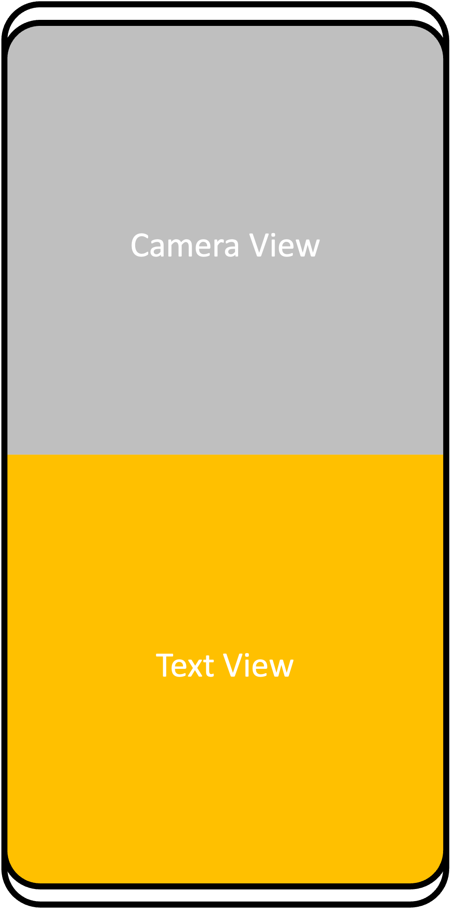
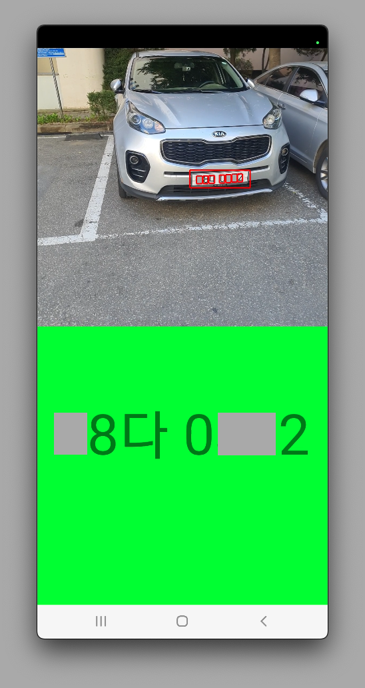

# VRPDetectorKOR (Vehicle Registration Plate Detector (Korea))

[한국어](#개요)  
[English (Translation)](#overview)  

# 개요
머신러닝을 이용하여 실시간으로 한국 차량 번호판을 인식하는 Android 애플리케이션입니다.  
본 애플리케이션은 <b>[ultralytics(yolov8)](https://github.com/ultralytics/ultralytics)</b>의 객체 감지 기능을 사용합니다. 학습된 모델을 <b>[onnx](https://onnxruntime.ai/)</b> 파일 형식으로 변환하여 <b>Android 12</b>에서 카메라 이미지 정보를 받아 실시간으로 동작합니다.  
테스트 기기로 '갤럭시 노트 10+'을 사용하였으며, 이외의 다른 스마트폰에서는 작동하지 않을 수 있습니다.  

# 설계

애플리케이션 상단 Camera View에는 카메라 미리 보기가, 애플리케이션 하단 Text View에는 인식한 자동차 번호판의 문자가 출력됩니다.  

자동차 번호판 인식은 두 단계로 진행됩니다.  
- 첫 번째로, 카메라가 촬영한 전체 이미지에서 자동차 번호판의 위치를 인식합니다.  
- 두 번째로 , 카메라가 촬영한 이미지 중 자동차 번호판 부분의 이미지에서 자동차 번호판의 문자를 인식합니다.  

첫 번째 단계에서 <b>[ultralytics(yolov8)](https://github.com/ultralytics/ultralytics)</b>로 학습된 차량 번호판 인식 모델이 사용됩니다. 학습에 사용된 데이터는 '<b>[링크](https://universe.roboflow.com/university-hassiba-ben-bouli/model-plate/dataset/6)</b>'를 사용했습니다. (라이센스: CC By 4.0)  

두 번째 단계에서 <b>[ultralytics(yolov8)](https://github.com/ultralytics/ultralytics)</b>로 학습된 차량 번호판 문자 인식 모델이 사용됩니다. 한국 차량 번호판에 사용되는 숫자와 문자를 인식하며, 학습에 사용된 데이터는 '<b>[링크](https://aihub.or.kr/aihubdata/data/view.do?currMenu=115&topMenu=100&aihubDataSe=realm&dataSetSn=172)</b>'를 사용했습니다. (라이센스 관련 [링크](https://aihub.or.kr/aihubnews/faq/list.do?currMenu=146&topMenu=104))  

# 결과

완성된 애플리케이션은 실시간으로 카메라의 이미지를 가져와 자동차 번호판을 인식하고, 번호판의 문자를 인식했습니다.  
아쉬운 점은 번호판의 문자를 인식하는 부분이 미흡하여 애플리케이션이 잘못 인식할 때도 있었습니다.  
특히 한글 인식률이 높지 않았고, 인식률을 높이기 위해 어쩔 수 없이 시간이 좀 더 오래 걸리는 모델을 사용했습니다.  
아마 각 한글의 학습 데이터의 양이 많지 않아 인식률이 낮은 것으로 추측됩니다.  

# Overview
This is an Android application that recognizes Korean vehicle registration plates in real time using machine learning.  
This application uses the object detection feature of <b>[ultralytics(yolov8)](https://github.com/ultralytics/ultralytics)</b>.
The learned model is converted to <b>[onnx](https://onnxruntime.ai/)</b> file format to receive camera image information from Android 12 and operate in real time.  
‘Galaxy Note 10+’ was used as a test device, and may not work with other smartphones.  

# Design

A camera preview is displayed in the Camera View at the top of the application, and the text of the recognized license plate is displayed in the Text View at the bottom of the application.  

License plate recognition is a tow-step process.  
- First, the location of the license plate is recognized from the entire image captured by the camera.  
- Second, the license plate characters are recognized from the image of the license plate of the image captured by the camera.  

In the first step, a license plate recognition model trained with <b>[ultralytics(yolov8)](https://github.com/ultralytics/ultralytics)</b> is used. The data used for learning used '<b>[link](https://universe.roboflow.com/university-hassiba-ben-bouli/model-plate/dataset/6)</b>'. (License: CC By 4.0)  

In the second step, a license plate character recognition model trained with <b>[ultralytics(yolov8)](https://github.com/ultralytics/ultralytics)</b> is used. It recognizes numbers and letters used in Korean vehicle registration plates, and the data used for learning used '[link](https://aihub.or.kr/aihubdata/data/view.do?currMenu=115&topMenu=100&aihubDataSe=realm&dataSetSn=172)'. (License related [link]((https://aihub.or.kr/aihubnews/faq/list.do?currMenu=146&topMenu=104)))  

# Result

The completed application took images from the camera in real time, recognized car license plates, and recognized the characters on the license plates.  
What is disappointing is that the recognition of license plate characters was insufficient, so the application sometimes recognized them incorrectly.  
In particular, the Hangul recognition rate was not high, and to increase the recognition rate, I had no choice but to use a model that took a bit longer.  
It is presumed that the recognition rate is low because the amount of learning data for each Hangul is not large.  
